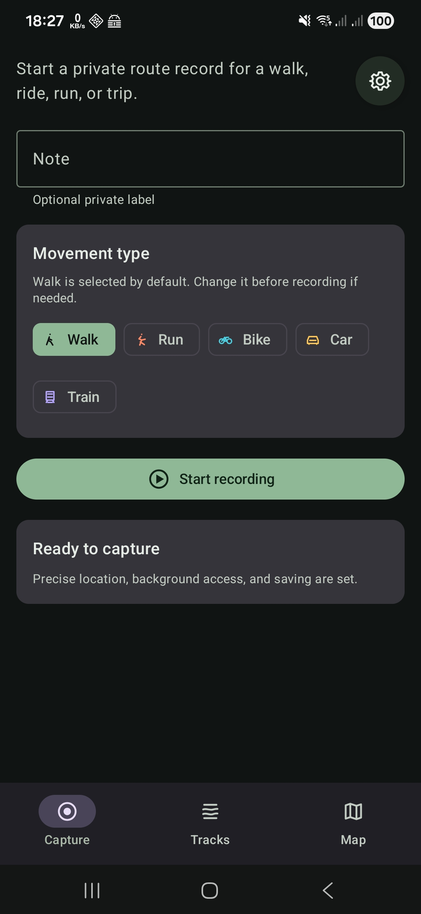
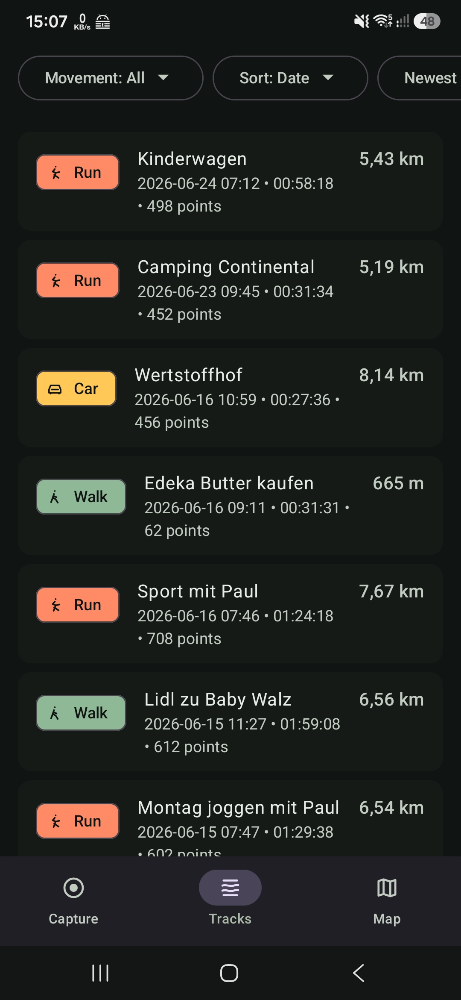
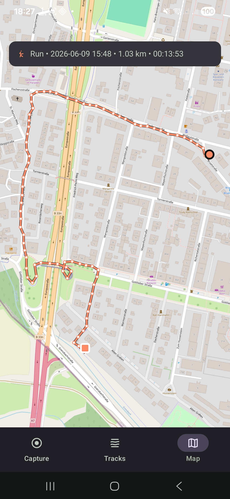
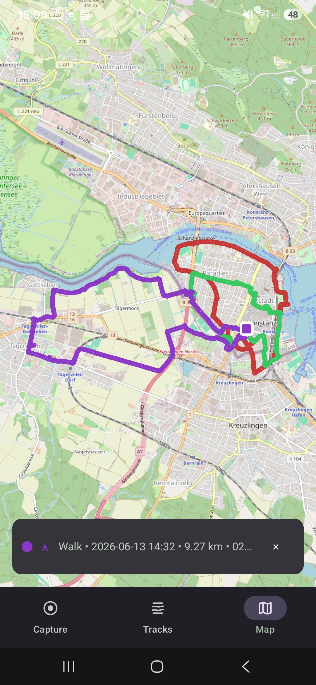

# StrideMap

StrideMap is a personal Android GPS reference-track recorder.

It captures real routes, saves user-accessible GPX files under `Documents/StrideMap/Tracks/`, and shows saved or live tracks on OpenStreetMap through osmdroid. This is a personal-use APK project, not a public app-store release.

## Screenshots

<p>
  
  
  
  
</p>

## Features

- Capture real GPS tracks from the `Capture` tab.
- Browse saved tracks from the `Tracks` tab, with Preview and Actions for each row.
- Display multiple saved or live tracks on the `Map` tab with OpenStreetMap tiles.
- Edit track messages with safe GPX metadata/filename updates, and delete eligible tracks.
- Export public GPX files to `Documents/StrideMap/Tracks/`.
- No accounts, cloud sync, remote API, or social sharing in v1.

## Personal APK build

Build a local release APK:

```bash
./gradlew :app:assembleRelease --no-daemon
```

For personal installs, the release variant uses the local Android debug key. No signing key is stored in this repository.

For a quick local install and launch on a connected device or emulator:

```bash
"/Users/USER_NAME/Library/Android/sdk/platform-tools/adb" install -r app/build/outputs/apk/release/app-release.apk
"/Users/USER_NAME/Library/Android/sdk/platform-tools/adb" shell am start -W -n app.stridemap.personal/com.example.stridemap.MainActivity
```
