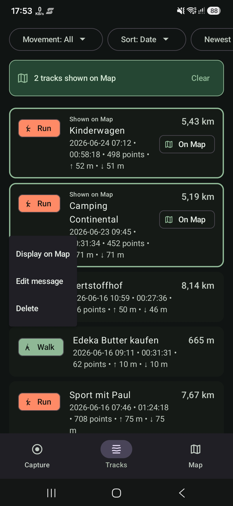
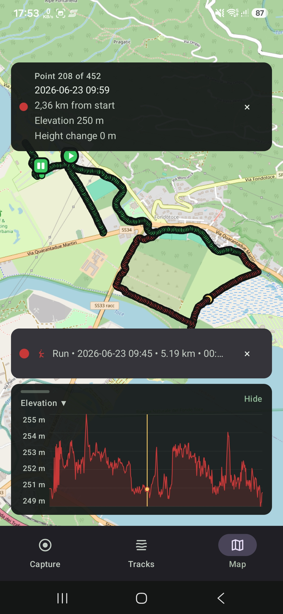
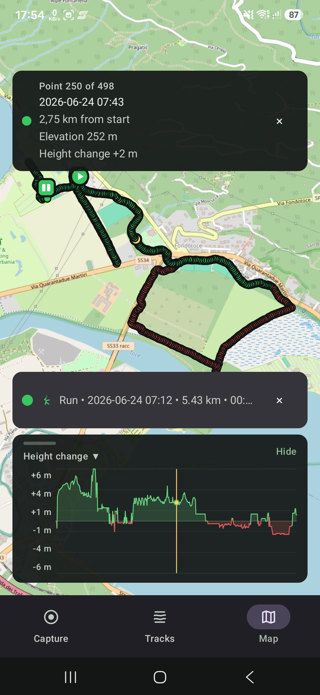
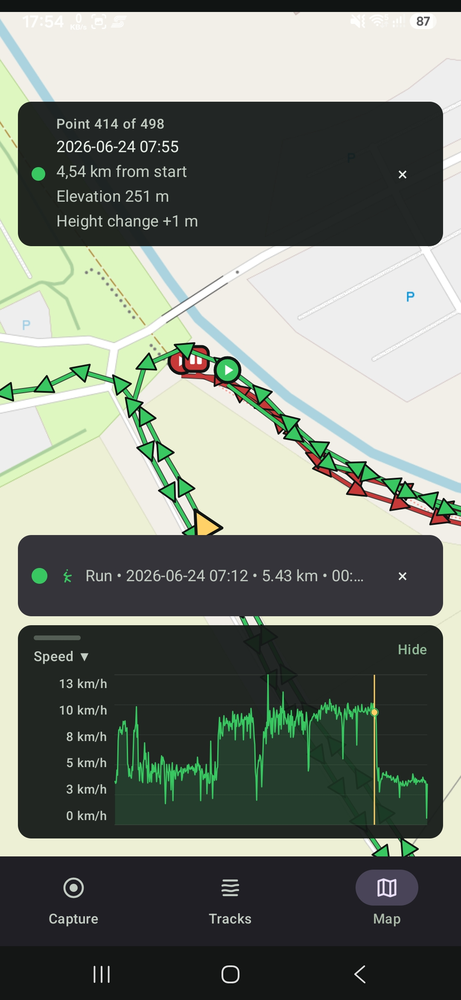

# StrideMap

StrideMap is a personal Android GPS reference-track recorder.

It captures real routes, saves user-accessible GPX files under `Documents/StrideMap/Tracks/`, and shows saved or live tracks on OpenStreetMap through osmdroid. This is a personal-use APK project, not a public app-store release.

## Screenshots

<table>
  <tr>
    <td></td>
    <td></td>
    <td></td>
    <td></td>
  </tr>
  <tr>
    <td></td>
    <td></td>
    <td></td>
    <td></td>
  </tr>
</table>

## Features

- Capture real GPS tracks with movement type selection, elapsed time, distance, point count, and foreground-service background recording.
- Save public GPX files to `Documents/StrideMap/Tracks/`, with an app-private active-session journal for capture recovery.
- Browse saved tracks from the `Tracks` tab with filtering, sorting, preview details, elevation gain/loss, altitude range, and safe edit/delete actions.
- Display multiple saved or live tracks on the `Map` tab with OpenStreetMap tiles, route colors, start/end/latest markers, selected-point tooltips, and zoom-aware point direction markers.
- Inspect track profiles from the Map overlay with selectable `Elevation`, `Height change`, and `Speed` views, including chart labels and tap-to-highlight point selection.
- Personal/local-first app: no accounts, cloud sync, remote API, fleet tracking, social sharing, or app-store release workflow in v1.

## Personal APK build

Build a local release APK:

```bash
./gradlew :app:assembleRelease --no-daemon
```

For personal installs, the release variant uses the local Android debug key. No signing key is stored in this repository.

For a quick local install and launch on a connected device or emulator:

```bash
"/Users/USER_NAME/Library/Android/sdk/platform-tools/adb" install -r app/build/outputs/apk/release/app-release.apk
"/Users/USER_NAME/Library/Android/sdk/platform-tools/adb" shell am start -W -n app.stridemap.personal/com.example.stridemap.MainActivity
```
